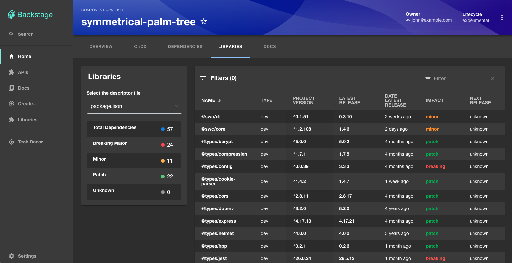
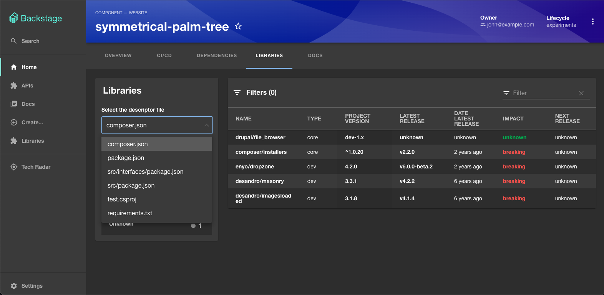
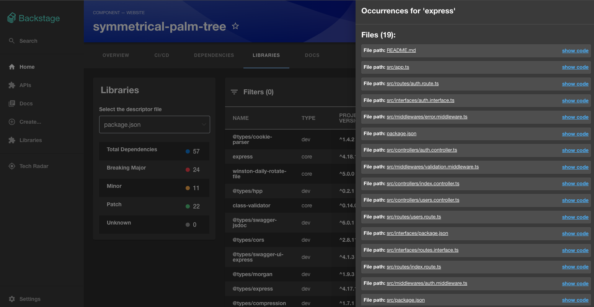
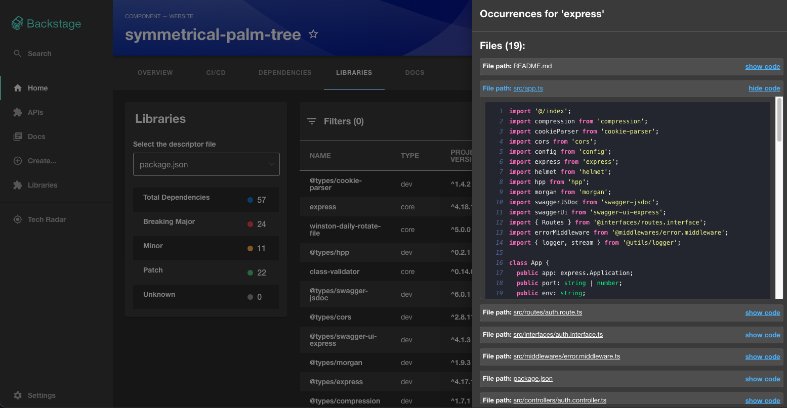
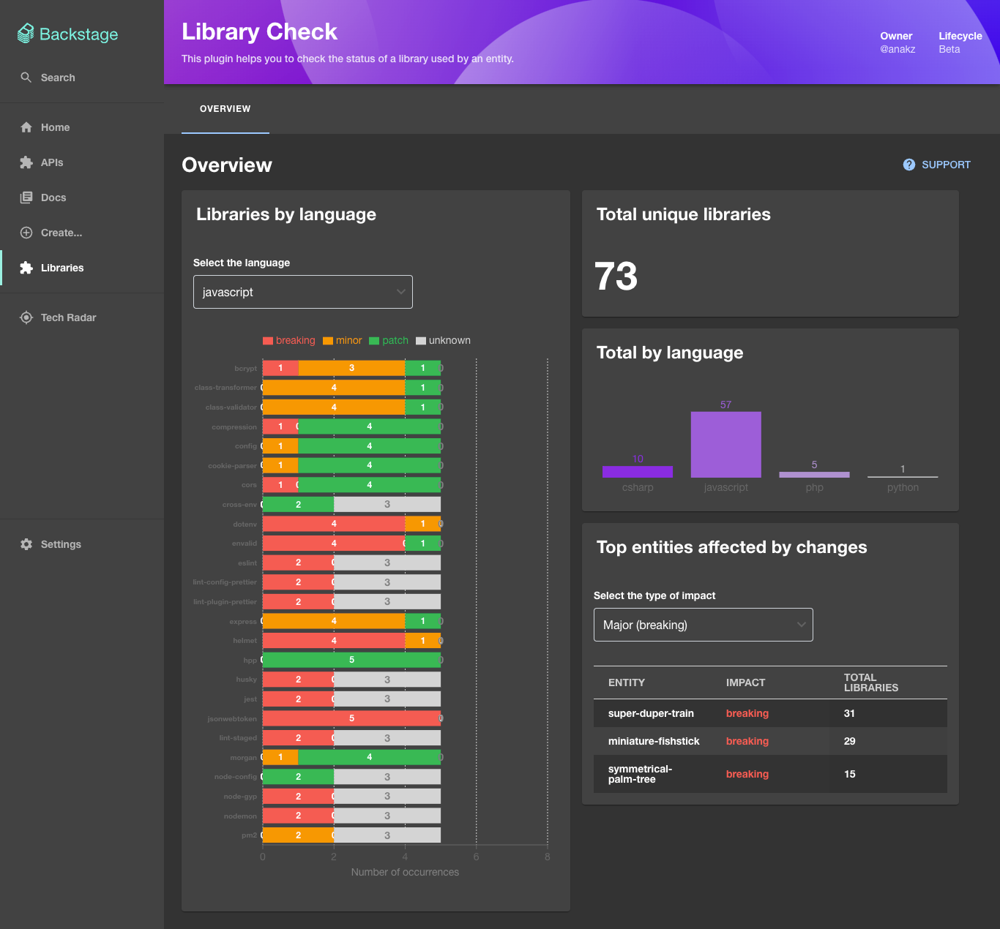

# Backstage.io Library Check Plugin

This plugin helps you explore project dependency libraries by offering insights and visualizing current, latest, and upcoming versions for your entire organization.

### Initial support:

| Descriptor Files              | Language       | Package Registry                                      | Status |
| ----------------------------- | -------------- | ----------------------------------------------------- | ------ |
| package.json                  | JavaScript, TS | [npm](https://www.npmjs.com/)                         | ✅     |
| requirements.txt              | Python         | [PyPI](https://pypi.org/)                             | ✅     |
| *.csproj                      | C#             | [Nuget](https://nuget.org/)                           | ✅     |
| composer.json                 | PHP            | [Packagist](https://packagist.org/)                   | ✅     |            
| pom.xml, build.gradle         | Java           | [Maven](https://maven.apache.org/)                    | 👩🏻‍💻     |
| go.mod                        | Go             | [pkg.go.dev](https://pkg.go.dev/)                     | ❌     |
| CMakeLists.txt, conanfile.txt | C++            | [Conan](https://conan.io/)                            | ❌     |
| pubspec.yaml                  | Dart           | [pub.dev](https://pub.dev/)                           | ❌     |
| Cargo.toml                    | Rust           | [Crates.io](https://crates.io/)                       | ❌     |
| package.swift                 | Swift          | [Swift Package Index](https://swiftpackageindex.com/) | ❌     |
| mix.exs                       | Elixir         | [Hex.pm](https://hex.pm/)                             | ❌     |
| package.yaml                  | Haskell        | [Hackage](https://hackage.haskell.org/)               | ❌     |
| Gemfile                       | Ruby           | [RubyGems](https://rubygems.org/)                     | ❌     |

If you have any suggestions for files/languages, please feel welcome to file an issue. 🙂  

## Key Features

1. **List of Entity Libraries:**

   - Interface to easily list the entity libraries in use.

2. **Summary Overview:**

   - Presents a summary of library usage, emphasizing the expected next version (when provided by registry)

3. **Automated Registry Verification:**

   - Streamlines the verification process against relevant registries.

4. **Smooth Integration:**
   - Integrates seamlessly with the Backstage.io platform, enhancing overall project management and development environment.

5. **Code Occurrences:**
   - Search for occurrences of the library in project files **(initial support only for GitHub Code Search)** ⚠️

## Setup

Find [installation instructions](./docs/setup.md) in our documentation.

## Examples

Entity libraries list:

## License

This library is under the [MIT](LICENSE) license.

## Issues

Please feel free to report any issues via github issues page.

## Future work

Please see the next features planned [here](./docs/new-features.md).
